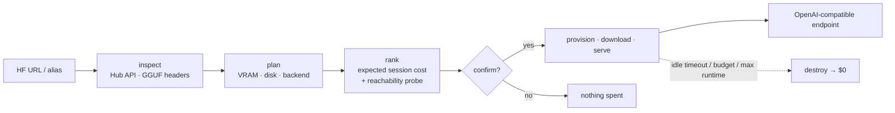

<!-- prettier-ignore -->
<div align="center">


# hfvast

[](https://github.com/matpeltier/hfvast/actions/workflows/ci.yml)

[](LICENSE)
[](https://docs.astral.sh/ruff/)
[](https://mypy-lang.org/)

> Turn a Hugging Face model into a temporary, OpenAI-compatible GPU endpoint on Vast.ai —
> then destroy it and pay nothing.

[Overview](#overview) • [Quick start](#quick-start) • [How it works](#how-it-works) • [Commands](#commands) • [Cost safety](#cost-safety) • [Supported models](#supported-models) • [Configuration](#configuration)

</div>

`hfvast` inspects any Hugging Face model repository, estimates its VRAM/disk/runtime needs,
picks a compatible inference backend (**llama.cpp**, **vLLM**, **SGLang**), ranks real Vast.ai
offers by *expected session cost*, and — only after explicit confirmation — rents a GPU,
downloads the model and hands you a ready-to-use OpenAI endpoint:

```
OPENAI_BASE_URL=http://<host>:<port>/v1
OPENAI_API_KEY=sk-hfvast-...
```

When you're done — or when the idle timeout expires — the instance is destroyed and the bill
returns to **$0**. No Kubernetes, no permanent hosting: ephemeral infrastructure by default.

```python
from openai import OpenAI

client = OpenAI(base_url=BASE_URL, api_key=API_KEY)
print(
    client.chat.completions.create(
        model="model",
        messages=[{"role": "user", "content": "Hello"}],
    )
    .choices[0]
    .message.content
)
```

## Overview



- **Inspection without downloads** — reads Hub metadata and parses GGUF headers remotely
  via HTTP range requests: architectures, quantization variants (multi-shard aware),
  context length, parameter counts, multimodal projectors.
- **Planning you can audit** — every VRAM/disk/cost estimate shows its inputs:

  ```
  Weight storage     179.7 GiB
  KV cache            46.0 GiB   ← computed from the real GGUF header
  Runtime overhead    10.3 GiB
  Safety margin        9.0 GiB
  Target VRAM        245.0 GiB
  ```

- **Explainable ranking** — offers are ranked by *expected session cost*
  (cold start + runtime), and every recommendation comes with explicit `+`/`−` reasons:
  VRAM headroom, NVLink, download bandwidth, reliability, topology penalties.
- **Live compatibility registry** — backend support is detected against llama.cpp's and
  vLLM's *current* upstream lists (fetched at run time), not a stale snapshot. New
  upstream architectures become deployable automatically.
- **A hardened gateway, not a raw backend** — the inference server binds to `127.0.0.1`
  only; a small authenticated gateway is the sole public surface, proxying `/v1/*` with
  SSE streaming preserved chunk-by-chunk.

### Features

- 🤗 GGUF (single & multi-shard) and safetensors inspection, gated repos included
- 🧮 Real VRAM math from parsed GGUF headers (MoE total weights — never "active params only")
- 💸 Cost caps as a dollar figure: `--budget`, `--max-hourly-cost`, `--max-total-cost`
- 🔌 Pre-rent reachability probe (Vast's geolocation data is unreliable — we test the IP)
- 🔁 Per-offer failure retry: broken hosts are detected, destroyed and skipped automatically
- ⏱️ Idle timeout (30 min) + hard max runtime (6 h) + `--budget` — three independent
  watchdogs, one local daemon and one in-container using Vast's per-instance
  restricted API key
- 🧹 Failure cleanup: any bootstrap failure destroys the instance and reports the incurred cost

## Quick start

```bash
pipx install hfvast        # or: uv tool install hfvast
```

You need a [Vast.ai API key](https://cloud.vast.ai/manage-keys/) and, for gated models,
a [fine-grained read-only HF token](https://huggingface.co/settings/tokens):

```bash
export VAST_API_KEY=...
export HF_TOKEN=...
```

> [!TIP]
> Without `VAST_API_KEY`, `hfvast quote` still works using clearly-labeled sample
> offers — you can explore planning and pricing before creating an account.

Then:

```bash
hfvast quote https://huggingface.co/org/model    # plan + real offers, nothing created
hfvast up https://huggingface.co/org/model       # confirm → deploy → get your endpoint
hfvast down                                      # destroy, billing stops immediately
```

Example `quote` session against a real 320B MoE repository:

```
Available variants
 Tier      Variant  Model size  Cheapest viable GPU    Price
 Economy   Q3_K_M      153 GB   3× A100 PCIE         $2.65/h
 Balanced  Q4_K_M      193 GB   3× A100 PCIE         $2.65/h
 Quality   Q6_K        263 GB   4× H100 NVL         $11.80/h

Recommended: 3× A100 PCIE
Why:
  + sufficient usable VRAM (+45 GB headroom)
  + reliability 99.92%
  + fast model download 1400 Mb/s (26 min)
```

```bash
$ hfvast up Qwen/Qwen2.5-0.5B-Instruct-GGUF --yes
...
OPENAI_BASE_URL=http://172.239.20.35:20202/v1
OPENAI_API_KEY=sk-hfvast-3ZFx...

Current cost (estimate): $0.02 (5 min × $0.09/h)
Destroy when done: hfvast down qwen2-5-0-119f
```

## Commands

| Command | Description |
|---|---|
| `hfvast inspect <model>` | Repository inspection: variants, sizes, architecture, backend support |
| `hfvast quote <model>` | Hardware plan + live Vast offers + cost estimates (never provisions) |
| `hfvast up <model>` | Quote → confirm → provision → serve; prints `OPENAI_BASE_URL` / `OPENAI_API_KEY` |
| `hfvast ps` | Active deployments with uptime and estimated spend |
| `hfvast status [id]` | Detailed status of one deployment |
| `hfvast endpoint [id]` | Re-print the endpoint + key as env vars |
| `hfvast cost [id]` | Itemized spend estimate for a deployment |
| `hfvast logs [id]` | Instance logs from Vast |
| `hfvast down [id]` | Destroy the instance — billing returns to $0 |
| `hfvast alias add/rm/list` | Name your models: `hfvast up glm-uncensored` |
| `hfvast doctor` | Environment, credentials and connectivity checks |

Useful `up` flags: `--quant Q4_K_M` · `--context 8192` · `--concurrency 1` ·
`--backend llama.cpp|vllm|sglang` · `--idle-timeout 30m` · `--max-runtime 6h` ·
`--budget 10` · `--min-download-mbps 20000` · `--max-gpus 4` · `--secure-cloud-only` ·
`--dry-run` · `--json`.

## Cost safety

> [!IMPORTANT]
> Nothing is ever provisioned without explicit confirmation, and `--budget 10`
> means **10 dollars, hard**: both watchdogs destroy the instance the moment the
> estimated spend exceeds it — during download, model load or serving.

- Cold-start costs are modeled per offer: image pull + model download (bandwidth is
  billed per byte on Vast) + model load, then runtime by the hour.
- Offers that advertise bandwidth they don't deliver are the main budget risk for
  multi-hundred-GB models — use `--min-download-mbps 20000` to force multi-Gbps hosts
  (B200/B300 class) where a 194 GB download takes minutes, not hours.
- The idle timer only counts user inference requests — health checks and long-running
  generations never trigger it.
- If bootstrap fails, the instance is destroyed automatically and the incurred estimate
  is printed (unless `--keep-on-failure`).

> [!WARNING]
> Vast.ai marketplace machines are third-party hosts. Assume they can read anything
> inside the container: use a fine-grained, read-only HF token scoped to the repos you
> need, and `--secure-cloud-only` if you require verified datacenter hosts. The
> unrestricted Vast API key never leaves your machine. See [SECURITY.md](SECURITY.md).

## Supported models

| Format | Backend | Status |
|---|---|---|
| GGUF | llama.cpp | ✅ verified — arch checked against llama.cpp master, live |
| safetensors | vLLM | ✅ verified — arch checked against vLLM's supported list, live |
| safetensors | SGLang | 🧪 experimental |
| Everything else | — | 🚫 refused before any spend |

Support levels: **SUPPORTED** deploys, **EXPERIMENTAL** requires explicit confirmation
(e.g. brand-new architectures the backend hasn't merged yet), **UNSUPPORTED** never
provisions. Diffusion, embeddings, rerankers, speech and `trust_remote_code` models are
out of scope and rejected before any resource is created.

## Configuration

Optional `~/.config/hfvast/config.toml` — CLI flags and environment take precedence:

```toml
[defaults]
idle_timeout = "30m"
max_runtime = "6h"
expected_session = "2h"
min_reliability = 0.98

[cost]
max_hourly = 3.0
max_total = 20.0

[vast]
secure_cloud_only = false

[aliases.glm-uncensored]
url = "https://huggingface.co/orcarouter/GLM-5.3-Flash-Uncensored-GGUF"
```

## Development

```bash
uv sync                # deps + dev tools
uv run pytest          # 96 tests — no network, no cloud, ever
uv run ruff check .    # lint
uv run mypy src        # strict typing
```

Integration tests hitting the real Hub are opt-in (`HFVAST_LIVE=1`) and never create
resources. Design docs live in [docs/architecture.md](docs/architecture.md) and
[docs/research.md](docs/research.md); see [CONTRIBUTING.md](CONTRIBUTING.md) to get started.
